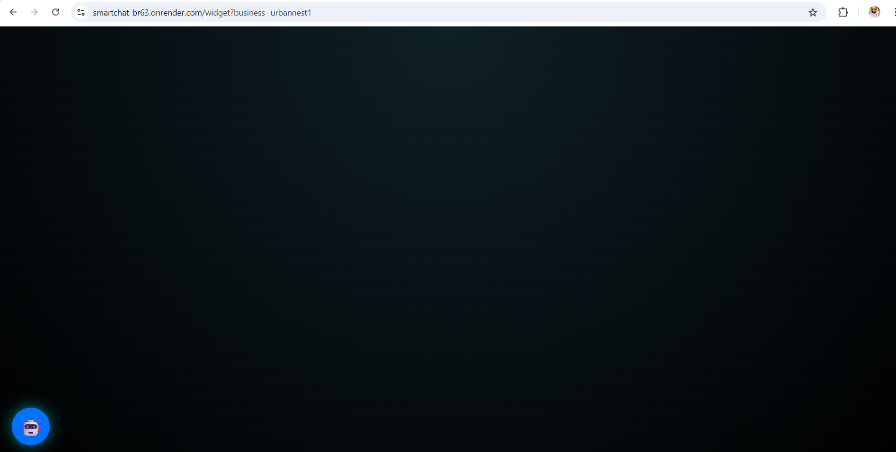
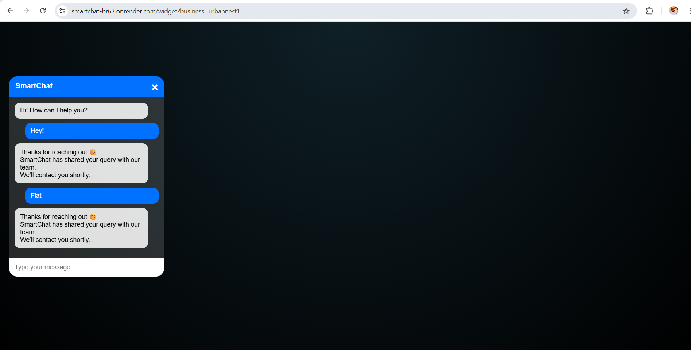
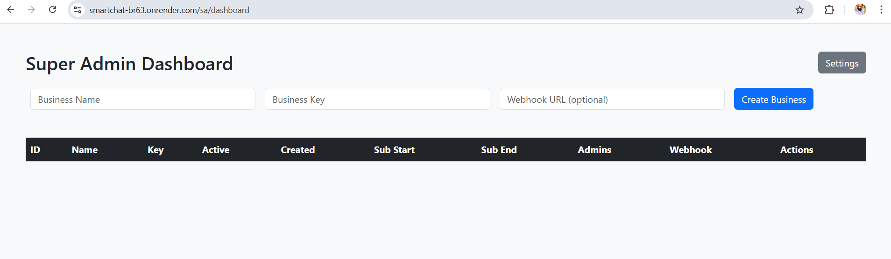
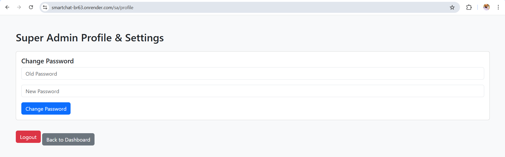
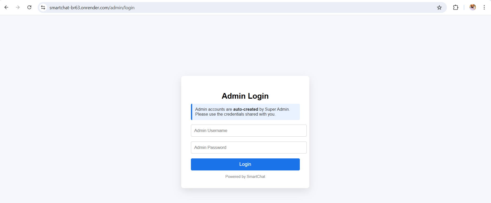

# 🤖 SmartChat – Multi-Business AI Chatbox SaaS Platform
SmartChat is a plug-and-play, **multi-tenant AI chatbox system** designed for **any type of business website**, 
such as:
- 🏢 Real Estate  
- 🏬 E-commerce  
- 🏥 Clinics  
- 🏫 Education  
- 🏨 Hotels  
- 🧑‍💼 Service-based businesses  
**UrbanNest** is used only as a **demo / example business** to showcase SmartChat’s real-world implementation.
Built with scalability in mind, SmartChat allows multiple businesses to operate independently from a single codebase, making it ideal for SaaS deployment.

## 🌟 The Story Behind SmartChat
SmartChat was born from a real-world problem. While developing UrbanNest, a real estate platform where users can buy, sell and rent properties seamlessly, one major challenge became evident: 
When customers had questions — technical or business-related — they had to wait for an admin response. 
This delay negatively impacted user experience. I explored existing chat solutions in the market and observed:
Most real-time chat services are paid.
- Subscription costs are high.
- Technical integration is complex.
- Ongoing support requires additional expenses.
- Non-technical business owners struggle with configuration.

That’s when the idea emerged: What if businesses could have a plug-and-play AI chat system that:
- Works like a simple plugin
- Requires minimal changes to an existing website
- Allows business owners to manage their own Q&A
- Captures leads automatically

Feels like a real customer care system. SmartChat was created to solve this problem. It is not just a chatbot — it is a self-managed, multi-business AI communication platform. Although still under active development, the core system is fully operational, including:
- Super Admin
- Business Admin
- Multi-business architecture
- Real-time chat engine
- Lead capture
- PDF automation
- Email notifications
The remaining work focuses on seamless website embedding and advanced integrations.

## 🧠 What SmartChat Does
SmartChat can be embedded into any business website to:
- Automatically answer customer queries (According to Admin Keyword Given in QnA Section) 
- Capture and manage leads  
- Export chat conversations as PDF  
- Email leads to the **respective business admin**  
- Maintain separate data, branding, and settings per business  
This makes **SmartChat a SaaS-ready product**, not a single-website chatbot.

## 🏗 Architecture Overview
### Multi-Tenant SaaS Model (One codebase → Unlimited businesses)
Each business has:
- Dedicated Business Admin 
- Unique business_key
- Isolated database records
Separate:
- Leads
- Chats
- QnA
- Settings

### 👤 Role-Based Access
#### 🔑 Super Admin
- Route: http://smartchat-br63.onrender.com/sa/login
- Credential logic:    username = "superadmin"    password = os.environ.get("SUPER_ADMIN_PASSWORD", "Admin@123")
- View & manage all businesses  
- Add & manage:
  - Business email  
  - Security key  
  - Business website  
- Monitor global leads & analytics  

#### 🧑‍💼 Business Admin
- Route: http://smartchat-br63.onrender.com/admin/login
- Credential logic:    username = "businessadmin"    password = os.environ.get("BUSINESS_ADMIN_PASSWORD", "Business_Admin@123")
- Login to own dashboard  
- Manage QnA keywords  
- View chat history & leads  
- Receive chat PDFs via email  
- Customize chat appearance  

### ✨ Core Features
#### 🧠 AI Chat Widget
- Floating AI chat button  
- Draggable chat widget & AI icon  
- Business-specific greetings  
- Keyword-based automated replies  
- Typing indicator & real-time chat  

#### 🏢 Multi-Business (SaaS Architecture)
- Unlimited businesses  
- Each business has:
  - Unique `business_key`
  - Separate chats, leads & QnA
  - Custom branding & settings  
- One codebase → many businesses  

#### 📄 Lead & PDF Automation
- Each chat session creates a **Lead**  
- Messages stored securely in database  
- Chat history exported as **Unicode-safe PDF**  
- PDF automatically emailed to the **business admin**  
- Optional webhook notifications supported  

### 🖼️ Screenshots (UrbanNest Demo)






> Screenshots are from the UrbanNest demo, but SmartChat works identically for **any business**.

## 🛠 Tech Stack & Development Environment
SmartChat is built using a modular, scalable, and production-oriented technology stack.
### Backend Architecture
- **Python (Flask)**
Lightweight WSGI framework used to build RESTful routes, role-based authentication, and multi-tenant business logic.

- **Flask-SQLAlchemy**
ORM layer for database modeling, relationship mapping, and query abstraction.

- **Flask-SocketIO**
Enables real-time, event-driven communication architecture (chat-ready infrastructure).

- **Gunicorn (Production WSGI Server)**
Used for deploying the Flask application in production environments.

### Frontend Layer
- **HTML5, CSS3, Vanilla JavaScript**
Used to build a lightweight, embeddable chat widget and admin dashboards.

- **Glassmorphism UI Design**
Modern UI styling approach for visual clarity and clean user experience.

- **Draggable / Drag-and-Drop Interactions**
Implemented using JavaScript DOM event handling for improved UX.

- **Script-Based Widget Injection**
Allows external website embedding using minimal integration code.

### Database Layer
- **SQLite (Development Environment)**
Lightweight relational database used for rapid development and local testing.

- **PostgreSQL (Production Recommended)**
Scalable, production-grade relational database for SaaS deployment.

### Document & Communication Services
- **ReportLab**
Used for Unicode-safe PDF generation of chat transcripts and lead reports.

- **SMTP (Simple Mail Transfer Protocol)**
Automated email delivery system for sending lead PDFs to Business Admins.

- **Webhook-Ready Architecture**
Extensible event-driven hooks for future third-party integrations.

### DevOps & Deployment
- **Render**
Cloud platform used for live deployment and staging environment.

- **Environment Variables Configuration**
Secure credential management using .env or cloud environment variables.

- **Procfile-Based Deployment Strategy**
Gunicorn process management for production serving.

### Development Environment
- **PyCharm IDE**
Primary development environment for backend implementation and debugging.

- **Git & GitHub**
Version control, source management, and repository hosting.

### AI-Assisted Development
During development, modern AI-assisted coding tools were leveraged for optimization, debugging, and architectural refinement:
- **ChatGPT**
- **GitHub Copilot**
- **Grok**
These tools were used as productivity enhancers — not as code generators — ensuring architectural ownership and implementation control remained manual.

## 📁 Project Structure
SmartChat/
│             
├───instance
│       ├── DataBaseFile
│       
├───leads
│       ├── lead_1.pdf
│       ├── lead_11.pdf
│       ├── lead_2.pdf
│       ├── lead_3.pdf
│       ├── lead_4.pdf
│       ├── lead_5.pdf
│       ├── lead_6.pdf
│       
├───services
│      ├── chat_engine.py
│      ├── email_service.py
│      ├── pdf_service.py   
│           
├───static
│      ├── chat.css
│      ├── chat.js
│      ├── chatbox.js
│      ├── widget_loader.js
│       
├───templates
│      ├── admin.html
│      ├── admin_analytics.html
│      ├── admin_chat_timeline.html
│      ├── admin_dashboard.html
│      ├── admin_login.html
│      ├── admin_qna.html
│      ├── admin_qna_suggestions.html
│      ├── admin_settings.html
│      ├── chat_widget.html
│      ├── manage_qna.html
│      ├── sa_dashboard.html
│      ├── sa_edit_business.html
│      ├── sa_login.html
│      ├── sa_profile.html
│       
├─── .gitignore
├─── app.py
├─── config.py
├─── create_super_admin.py
├─── create_urban_admin.py
├─── LICENSE
├─── models.py
├─── Procfile
├─── README.md
├─── requirements.txt
├─── run.py
        
## ⚙️ Setup Instructions
```bash
git clone https://github.com/sunilprajapati832/smartchat.git
cd smartchat
python -m venv venv
source venv/bin/activate   # Windows: venv\Scripts\activate
pip install -r requirements.txt
python app.py
```

## 🔐 Business Configuration Flow
### Each business provides:
- **Business Email (for lead PDFs)**
- **Security Key**
- **Business Website URL**
    - **Managed by Super Admin**
    - **Used for email + webhook delivery**
    - **Fully isolated per business**

## Production Ready
SmartChat is ready for:
- **SaaS deployment**
- **Subscription-based model**
- **Multiple clients**
Cloud hosting (Render, Railway, VPS, AWS)

## 📊 Admin Analytics (In Progress Enhancement)
- Chat activity tracking
- Keyword suggestions
- Conversation timeline
- Lead monitoring dashboard

## 🔮 Future Enhancements
- Website auto-integration system
- Subscription & billing integration
- AI-based NLP enhancement
- Multi-language support
- Live human-agent takeover
- Advanced analytics dashboard

## 👨‍💻 Author

**Sunil Prajapati**<br>

M.E. Graduate | Python & Flask Developer <br>

[](https://www.linkedin.com/in/sunil-prajapati832)

⭐ If you find this project valuable, feel free to star the repository and connect!


